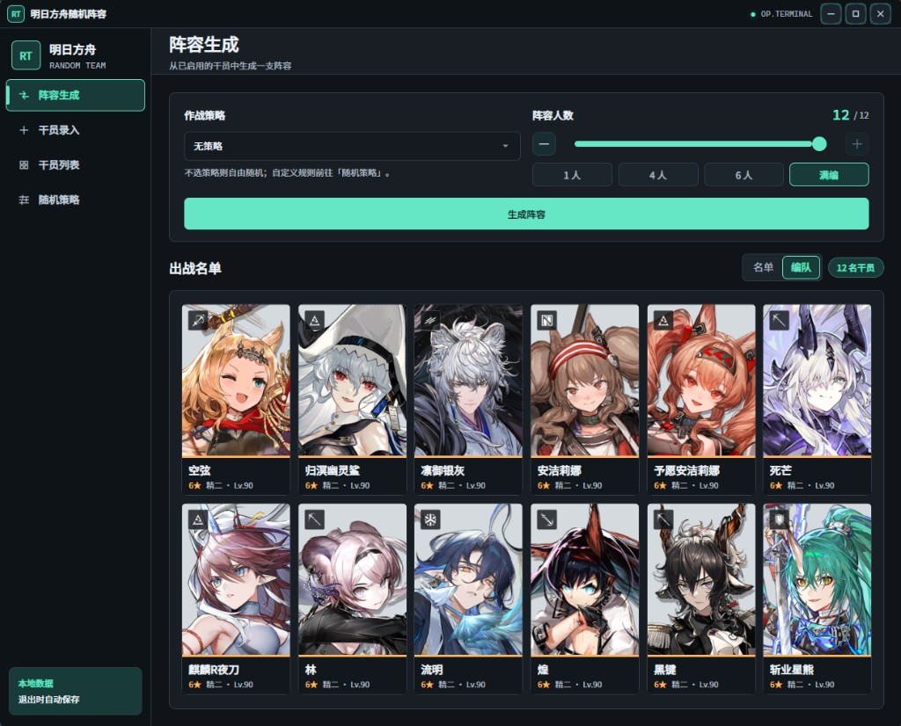
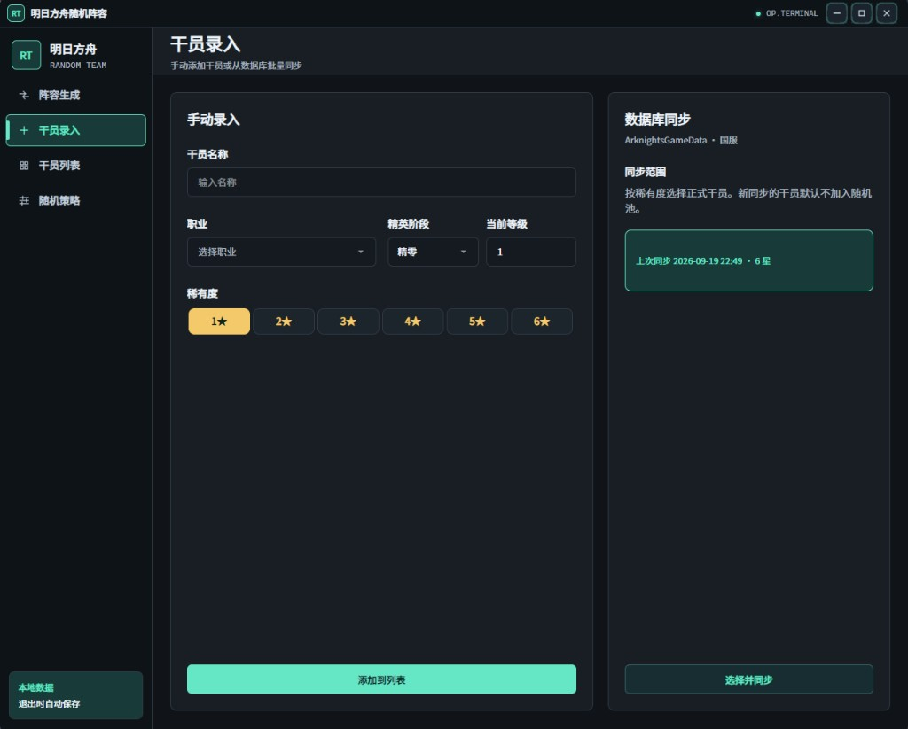
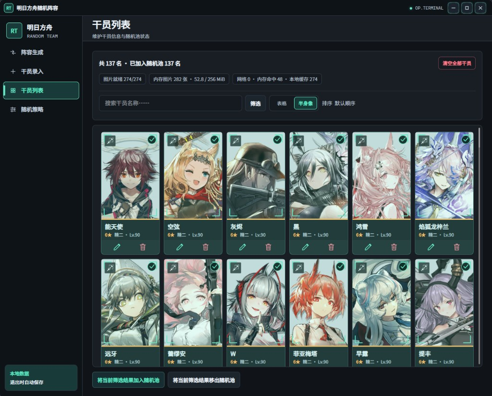
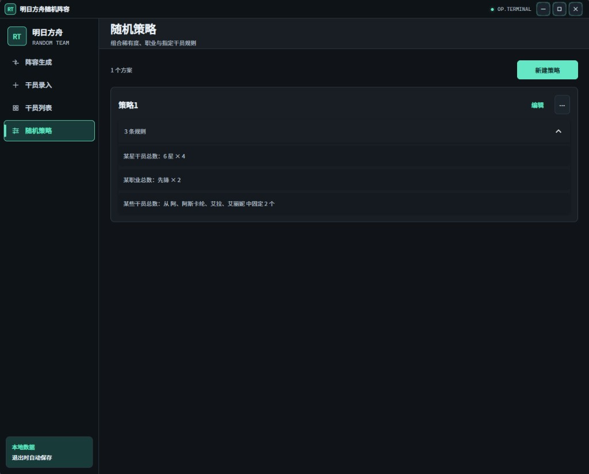

# 明日方舟随机阵容

从你的干员里随机抽出一支通关队伍。可以先随便抽，也可以自己定规则，比如「6 星要几个、先锋要几个、某几位里必须出现几人」。

  <a href="https://juhkff.github.io/arknights-random-team/"><b>打开网页版</b></a>
  &nbsp;·&nbsp;
  <a href="https://github.com/juhkff/arknights-random-team/releases/latest">下载桌面版</a>

网页版不用安装，第一次打开会稍等一会儿。**关掉或刷新页面后，名单和策略都会清空**；想长期留着数据，请用桌面版。Windows、macOS、Linux 都可以下载。

## 界面预览

**阵容生成**

**干员录入**

**干员列表**

**随机策略**

## 怎么用

1. **先有一份名单**  
   可以手动一个个加，也可以在「干员录入」里按星级从国服数据批量同步。新同步来的干员默认不参加抽取，需要你在列表里勾选。

2. **勾选要抽的人**  
   打开「干员列表」，把想进随机池的干员勾上。也可以搜索、筛选，或改成半身像视图。

3. **生成阵容**  
   选人数，点「生成阵容」。抽过的人不会在同一局里再出现。结果可以在名单和编队两种样子之间切换。

4. **想加限制就建策略**  
   例如固定若干个 6 星、某职业要几人、或从指定几位干员里抽出几人。生成时选中这条策略即可。

同步只会追加正式干员，不会删你手工加的人，也不会改掉已经在名单里的等级和勾选。

## 桌面版的数据

关掉程序时会自动保存在软件所在的文件夹里。以前用过旧版的话，把原来的 `StaffList.xml` 和 `RandomStrategies.json` 拷到同一目录就能接着用。
